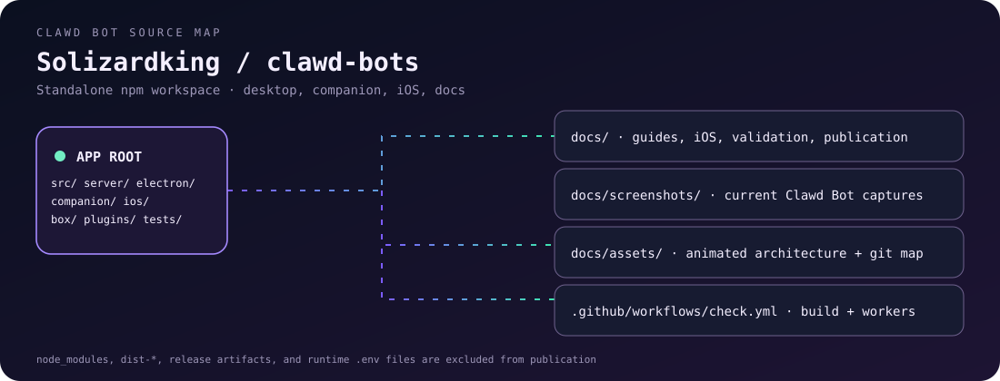
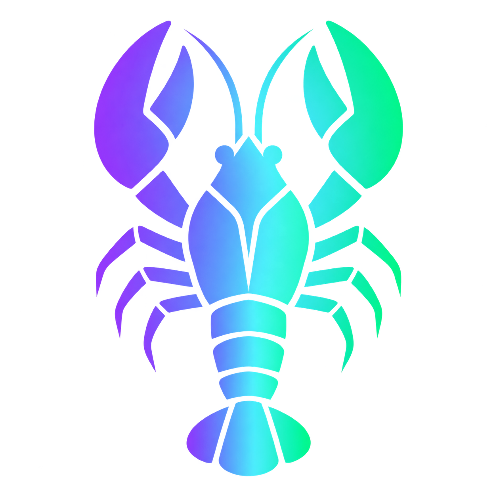

# Clawd Bot

<p align="center">
  
</p>

<p align="center">
  
</p>

<p align="center">
  
</p>

[Development](#development) · [What changed](#what-changed) · [Pets and spinners](#pets-and-spinner-themes) · [Builds](#checks-and-builds) · [Publication](#github-publication) · [Screenshots](docs/screenshots/README.md)

Production remote: **[Solizardking/clawd-bots](https://github.com/Solizardking/clawd-bots)**. Parent reconstruction: **[Solizardking/grok-bot-0.18-reconstructed](https://github.com/Solizardking/grok-bot-0.18-reconstructed)**.

<p align="center">
  
</p>

A local-first desktop workspace for teams of AI agents, with a React interface,
CLI-backed agent sessions, computer tools, and Solana integrations. This directory
is a standalone repository: install and run the commands below **from this directory**.
The parent Grok Bot reconstruction is not required.

## What changed

| Area | Current implementation |
| --- | --- |
| Standalone source tree | Independent npm lockfile and Node version, imported runtime dependencies, Telegram build recipes, optional gateway, and retained provenance notices. |
| Desktop packaging | Bundled server, companion, and updater; staged native tools; packaged data isolated under Electron's user-data workspace. |
| Brand refresh | Purple lobster app icon and regenerated pose/activity sheets, state-aware default avatars, and exports for web and native platforms. |
| Animated companions | Bundled Clawd Codex atlas credited to @clawddevs, bot-state animation, active group responder support, reduced-motion handling, and hidden-tab pause. |
| Pet creator and library | Procedural pixel pets, PNG/WebP uploads, nine-pose previews, validated Codex ZIP import/export, and local IndexedDB storage. |
| Spinner themes | All 45 bundled SOL-GPT verb packs, with profile-local selection and phrases that rotate while agents work. |
| Validation and publication | Isolated test state, CI checks, packaged-server smoke tooling, source publication audit, and fresh-history export. |

The workspace also includes team conversations and delegation, routines,
computer controls, voice, connected apps, and mobile companion sources. See
[computer use](docs/computer-use-integration.md), [voice](docs/voice-mode.md),
[Composio](docs/composio.md), and [iOS companion](docs/ios-companion.md) for
configuration and platform requirements.

[Validation notes](docs/validation.md) and the
[2026-09-07 install report](docs/install-status-2026-09-07.md) distinguish
recorded checks from live integration and release requirements. Optional
services in this standalone tree are its imported snapshot; parent repository
updates are not automatically synchronized into those copies.

## Development

Use the Node version in `.node-version` and npm. The npm lockfile is the install
contract; the old pnpm inventory is retained under `docs/reconstruction/` only.

```sh
npm ci
npm run dev:server       # full agent server, loopback port 8799
# In another terminal:
npm run dev             # Vite interface, http://127.0.0.1:5199
# Optional third terminal:
npm run dev:desktop     # Electron shell; stages the pinned cloudflared binary
```

Install and authenticate at least one supported agent CLI (such as Codex or
Claude Code) to run agent conversations. Computer control requires the appropriate
native platform tools and permissions. Provider accounts and hosted services are
not supplied by this repository. Development data lives in `~/.clawdbot`.
Packaged desktop installs use `workspace` inside Electron's user-data directory
(on macOS, `~/Library/Application Support/clawd-bot/workspace`) to avoid sharing
legacy CLI/gateway state. Set `CLAWD_DATA_DIR` to override either location.

`npm run dev:harness` is the smaller Solana/connector diagnostic harness. It does
not implement the full chat API and is not the normal app backend. Its wallet
storage is a development implementation; do not use it to store funded wallets.

## Checks and builds

```sh
npm run build                 # types, UI, bundled server, companion, updater
npm test                      # app/server/Electron unit and contract tests
npm run test:integrations     # imported Telegram/router/plugin tests
npm run build:bridge          # .build/telegram-bridge/server.cjs + deployment files
npm run build:service         # services/telegram-fly/dist/server.mjs
npm run publication:check     # current source tree checks; not a history scan
```

Build output is generated locally and excluded from Git. Desktop packaging uses
`electron-builder.yml`; native tools must be staged for the target platform.
Signing, notarization, hosted integrations, and release publishing require your own
configuration. The inherited release destination is disabled to avoid publishing
or updating against another project's releases.

## Included integrations

- `box/openai-hop-session.cjs`: streaming OpenAI-compatible hop adapter; its fallback
  provider map is `tools/provider-maps.cjs`. It preserves the existing host contract.
- `source/`: the transitive reconstruction source needed by the imported Telegram
  services and their tests. It is separate from Clawd's `src/` and `server/`.
- `deploy/telegram-bridge/`: container/Fly templates for the standalone bridge.
  Build first, then deploy the generated `.build/telegram-bridge` directory after
  choosing your own Fly app name and configuring runtime secrets.
- `services/telegram-fly/`: headless provider-backed Telegram service and build recipe.
- `services/provider-gateway/`: optional OpenAI-compatible gateway service.
- `plugins/`: PayBox and trading tool instructions, including their existing notices.
- `cloudflare/`: optional control plane and Composio broker. Each package has its
  own manifest and deployment instructions; install its dependencies separately.
- `apps/docs/`: optional documentation site with its own package manifest.

Deployment templates contain inherited example resource names. Set your own app,
account, database, and hostname values before deployment. Keep credentials in the
platform's secret store or ignored local files. `deploy/openrouter.env.example`
and the Worker `.dev.vars.example` files document configuration names.

## Branding

The new icon and both regenerated mascot sheets are in [`public/brand/`](public/brand/README.md).
Default avatars select a pose by bot state; explicit legacy expression previews
still use the vector renderer. Run `npm run icons` on macOS to export the icon
master to web, Electron, macOS, Windows, Linux, and iOS formats.

## GitHub publication

See [the import and publication audit](docs/github-readiness.md) for what was
included from the parent, what is regenerated, and the historical credential issue.
Create a fresh source snapshot without carrying old Git history:

```sh
npm run publication:export -- /absolute/path/to/new-clawd-source
```

The destination must not exist. Review the export before creating a new repository.
The command never copies `.git`, local credentials, dependencies, or build output.
Do not publish the original history until exposed credentials have been rotated
and the historical blobs have been handled.

## Attribution

The Clawd application derives from OpenMausBot under Apache-2.0; see [LICENSE](LICENSE)
and [NOTICE](NOTICE). Imported reconstruction material retains its separate
[notice](docs/reconstruction/NOTICE.md) and [provenance](docs/reconstruction/PROVENANCE.md).
The Apache license is not a new license grant over that material or third-party
plugins. This project is not an official Grok, Cursor, or xAI product.

### Pets and spinner themes

Open **Settings → Pets** (or click the pet below chat) to select a companion.
Clawd is included with its original Codex animation atlas, credited to @clawddevs.
The companion follows working, streaming, waiting, and offline bot states, including
active group responders. Hide it with **Show pet below chat**.

- **Create:** name a pet, choose a color and design seed, and generate a local
  pixel creature. This is procedural generation, not an AI image service. Upload
  PNG/WebP artwork to animate your own character instead. Preview all nine poses,
  then save it to your library.
- **Import:** select a Codex ZIP, or select `pet.json` and its spritesheet together.
  Supports v1 manifests and 1536 × 1872 PNG/WebP atlases (8 × 9 cells). Each ZIP
  must contain exactly one pet, either at its root or in a folder. Import checks
  paths, archive expansion, image dimensions, and manifest version.
- **Export:** download a Codex ZIP containing the manifest and spritesheet.
- **Spinners:** choose from all 45 SOL-GPT verb packs. Phrases change while a bot
  works; the actual bot state still controls the animation.

Custom pets are stored in IndexedDB; selection, visibility, and spinner theme are
stored in localStorage for this browser/desktop profile. They do not sync across
machines. Export pets before clearing app data. Animation respects reduced motion
and pauses in hidden tabs. Runtime assets are bundled under `public/pets/clawd/`;
no dependency on the original `/Users/8bit/sol-gpt` folders remains.

### Solana workspace

Open **Solana mode** in the sidebar or welcome screen to enable the Solana
palette and right-side workspace. It remembers the mode across reloads; switching
it off restores the previous skin. The panel docks alongside chat on wide screens
and becomes a full-width drawer on phones. Close it with the × button or Escape.

**Pump.fun** displays native launch cards from `wss://clawd-ws.fly.dev/ws`, with
search by name/symbol/mint, a GitHub filter, pause/resume, mint copying, and links
to Pump.fun and Solscan. The feed retains the latest 120 unique mints and reconnects
automatically. Pausing skips incoming launches. Market caps are launch snapshots
in SOL, not current quotes; disconnected/stale state is explicitly displayed.

**Wallets & assets** uses the existing Solana wallet, credential, and Helius asset
APIs. Errors remain visible with a wallet retry action. No transaction is sent by
opening the workspace or browsing tokens.

Validation: `node scripts/smoke-solana-workspace.mjs` against the dev server on
port 5299 (or set `CLAWD_SMOKE_URL`). The smoke uses a controlled WebSocket fixture
to check theme restoration, native feed controls, wallet view, and mobile layout.

### Retained pairing prototype

`src/pair/PairPage.tsx` is an unconnected upstream prototype whose session
client and email sign-in endpoints are absent from this reconstruction. It is
retained as source reference and excluded from the application typecheck;
`src/main.tsx` does not import or expose it. Supported device pairing lives
in the companion service. The bot-settings fixture uses the current
`SettingsPanel` and persisted bot fields.

### npm distribution

Run `npm run npm:prepare` to build and create a scanned staging tree under
`publication/npm-<version>-<timestamp>/`. Run `npm pack` in that directory
and inspect the archive before `npm publish --access public`. The checkout
remains private to prevent accidentally publishing local files directly.
The staged package contains the source projects and built UI, server,
companion, and updater. Native desktop bundles are built separately using
`package:mac` or `package:linux`; local caches, dependencies, private `.env`
files, and work data are not part of the public package.

The npm command starts the web application on loopback:

```sh
clawd-bot --env-file /absolute/path/to/private.env --port 8799
```

Open `http://127.0.0.1:8799`. The environment file is optional and remains
on your machine; configured process variables take precedence. CLI-backed
agents still require their respective CLIs and authentication.
