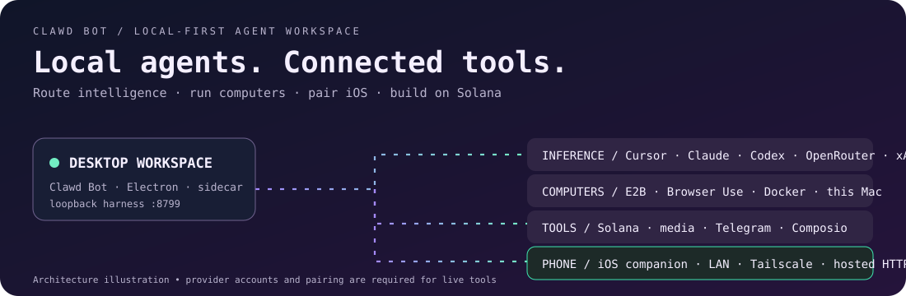
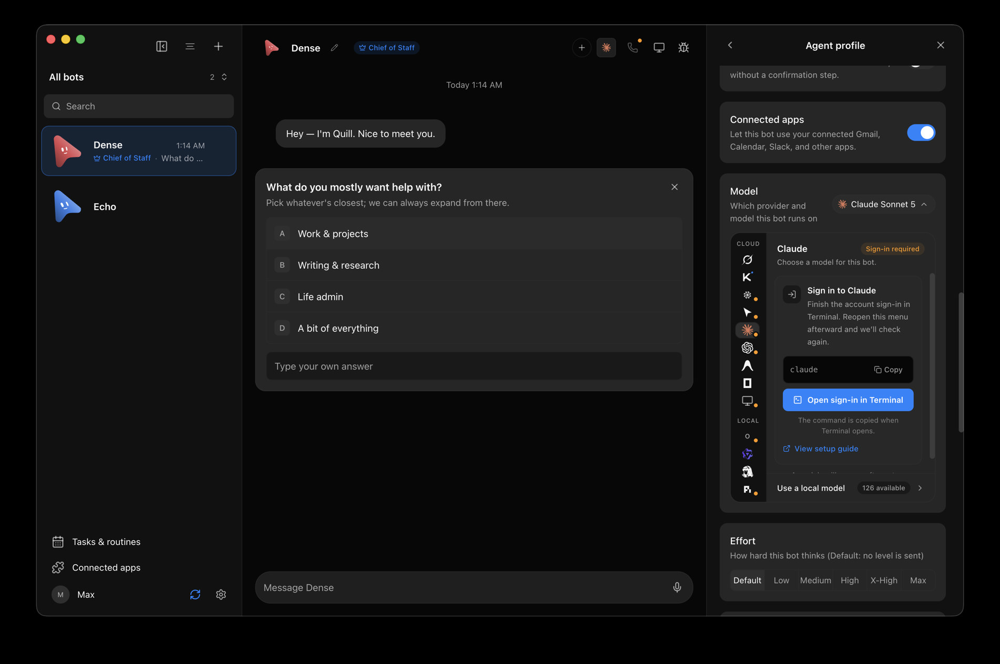

# Clawd Bot documentation

  

  

Run commands in this documentation from the `clawd/` repository root unless a guide says otherwise. Use the Node version in `.node-version` and `npm ci`; the pnpm files under `reconstruction/` are historical records.

Current desktop and iOS captures: [screenshots](screenshots/README.md). Source publication remote: [github-readiness](github-readiness.md). Public website: [https://clawdbot.party](https://clawdbot.party). Solana Mobile: [https://clawdbot.party/mobile](https://clawdbot.party/mobile).

## Setup and integrations

| Guide | Implementation and validation scope |
| --- | --- |
| [Avatar storage](avatar-storage.md) | Shared attachment storage, supported formats, retention and profile updates. |
| [VPS computers](byo-vps.md) | Docker over SSH; requires an owner-configured Linux VPS. |
| [Composio](composio.md) | Project-key or managed-broker connections; provider authorization is required. |
| [Computer use](computer-use-integration.md) | Electron CUA, embedded browser, cloud and VPS target boundaries. |
| [Cursor](cursor.md) | CLI-backed ACP engine; requires installed CLI and usable login. |
| [OpenCode](opencode-go.md) | CLI-discovered model catalog and ACP engine. |
| [Voice mode](voice-mode.md) | Read-aloud and macOS calls; native permissions and audio require device checks. |
| [Linux desktop](linux-desktop.md) | Ubuntu x86_64 packaging, Xorg control and Wayland preview. |
| [iOS companion](ios-companion.md) | Native phone build, pairing, route filtering and reconnect. |
| [iOS privacy](ios-privacy.md) | Source-level data flows and distribution disclosures. |
| [Notification QA](notification-and-proactivity-qa.md) | Exact-task navigation, routines and trigger behavior. |
| [Podman setup](../deploy/podman/README.md) | Source-built Linux x86_64 container deployment on loopback. |

## Validation and release

- [Validation commands](validation.md)
- [Source publication](github-readiness.md)
- [Desktop releases](releasing.md)
- [Current adaptation evidence](adaptation-status.md)

The local `install-status-2026-09-07.md` file is an ignored historical installation/incident record, when present. It is not required in a public source export and is not a current health report.

## Reference material

- [Architecture assets](assets/README.md) ([flow](assets/project-flow.svg), [git map](assets/git-map.svg))
- [Screenshot reference inventory](screenshots/README.md)
- [iOS visual reference](ios/README.md)
- [Planning archive and implementation map](plans/README.md)
- [Superpowers plans and specs](superpowers/README.md)
- [Reconstruction provenance](reconstruction/README.md)

Run `npm run docs:check` to validate local Markdown links and documented npm script names. Historical plans describe their original context; current guides and source take precedence.
