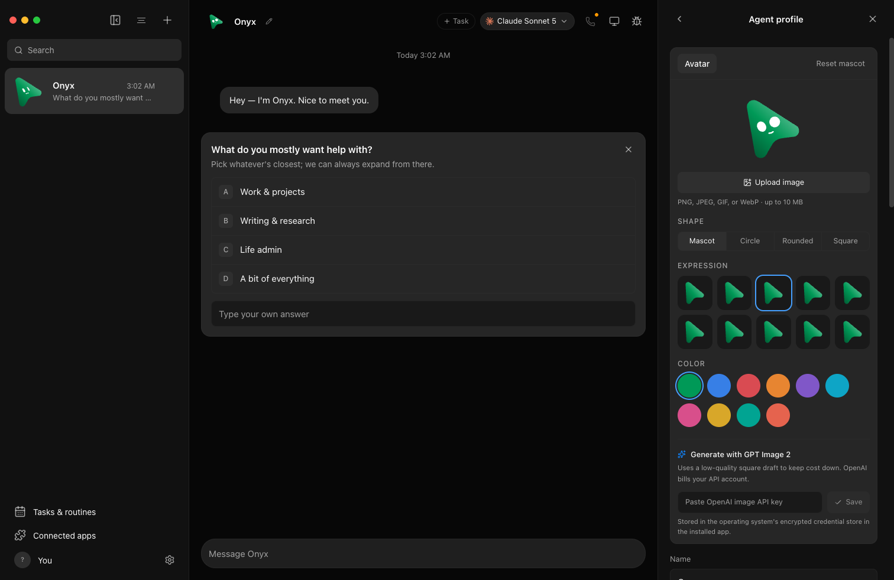
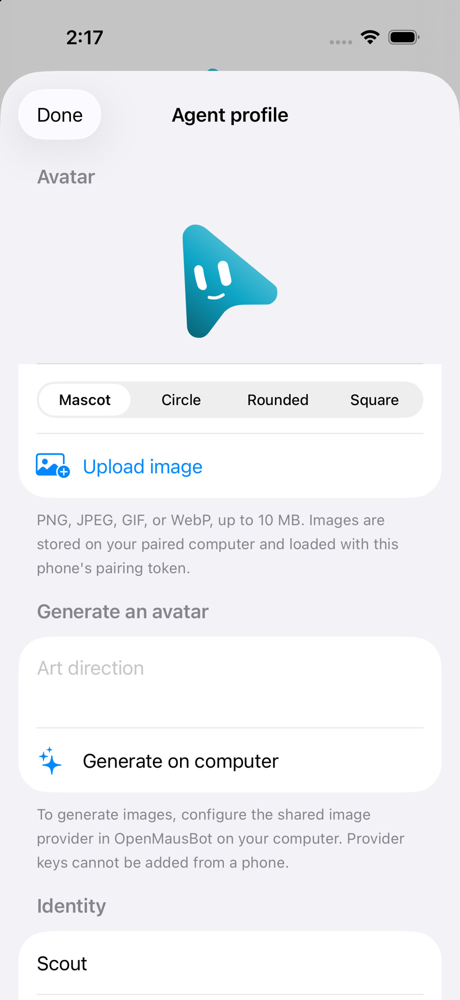
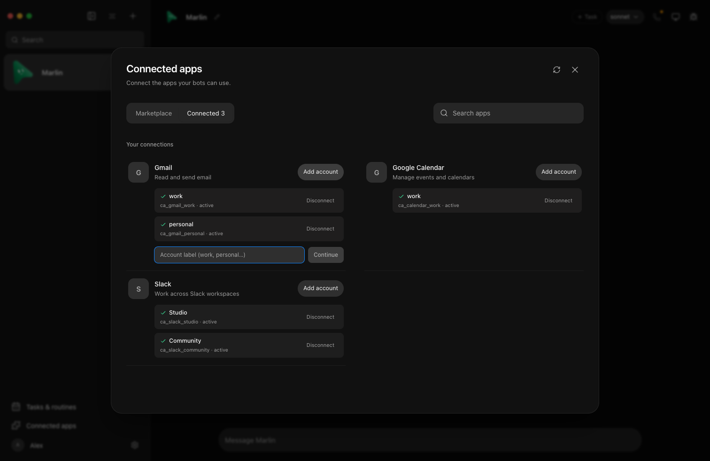
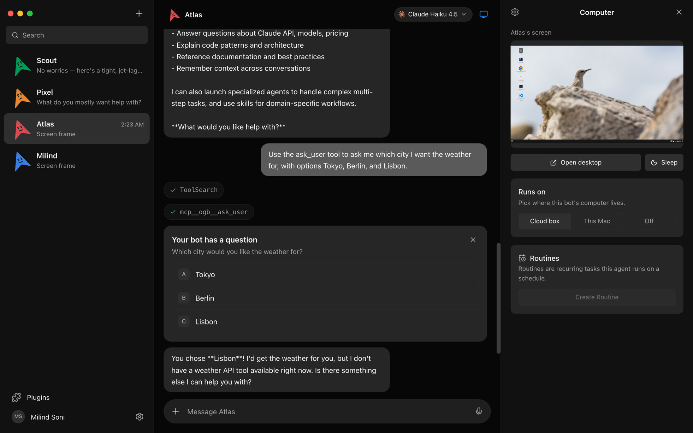

# Screenshot references

Current captures are Clawd Bot (desktop Electron shell and the native iOS companion). Historical upstream files remain in this folder for provenance; do not treat an old OpenMausBot filename as a newly verified Clawd Bot screen.

Choose a matching screen, viewport, theme and data state before comparing with a running app. Runtime artwork belongs in [public](../../public/), not this archive.

## Current Clawd Bot

| File | What it shows |
| --- | --- |
| [hero.png](hero.png) / [clawd-onboarding-model.jpg](clawd-onboarding-model.jpg) | Desktop workspace: Dense + Echo, onboarding quiz, Claude Sonnet 5 picker. |
| [agent-profile-desktop.png](agent-profile-desktop.png) | Desktop **Agent profile**: mascot expressions, colors, upload, GPT Image 2. |
| [agent-profile-ios.png](agent-profile-ios.png) / [clawd-agent-profile-ios.jpg](clawd-agent-profile-ios.jpg) | iOS **Agent profile**: Scout mascot, shape, upload, generate-on-computer. |
| [agent-profile-model-picker-after.jpg](agent-profile-model-picker-after.jpg) | Model picker open on Claude with cloud/local engines. |
| [agent-profile-model-picker-before.jpg](agent-profile-model-picker-before.jpg) / [clawd-agent-workspace.jpg](clawd-agent-workspace.jpg) | Same profile with working folder and execution timeline. |
| [agent-roster-avatar-only.png](agent-roster-avatar-only.png) | Compact roster + Onyx profile. |
| [app-settings.png](app-settings.png) / [clawd-connections.jpg](clawd-connections.jpg) | **Settings → Connections**: Composio, Box, OpenCode Go keys. |
| [composio-multi-account.png](composio-multi-account.png) / [clawd-connected-apps.png](clawd-connected-apps.png) | Connected apps: Gmail, Calendar, Slack accounts. |
| [computer-panel.png](computer-panel.png) / [clawd-computer-panel.jpg](clawd-computer-panel.jpg) | Computer panel, cloud box, routines, approval card. |
| [context-menu.png](context-menu.png) / [clawd-context-menu.jpg](clawd-context-menu.jpg) | Bot context menu: pin, Chief of Staff, duplicate, delete. |
| [docs-onboarding.png](docs-onboarding.png) / [clawd-onboarding.jpg](clawd-onboarding.jpg) | Fresh-bot onboarding quiz. |

## Historical / upstream inventory

These files keep older interface states, including upstream names such as `openmausbot-live-window.png`. Preserve their pixels and filenames rather than relabeling an old product as a newly verified build.

- [approval-card.png](approval-card.png)
- [custom-claude-inject.jpg](custom-claude-inject.jpg)
- [custom-claude-official.jpg](custom-claude-official.jpg)
- [custom-grok-inject.jpg](custom-grok-inject.jpg)
- [custom-grok-official.jpg](custom-grok-official.jpg)
- [docs-automations.png](docs-automations.png)
- [docs-engine-detection.png](docs-engine-detection.png)
- [marketplace.png](marketplace.png)
- [onboarding-quiz-dismiss.gif](onboarding-quiz-dismiss.gif)
- [openmausbot-live-window.png](openmausbot-live-window.png)
- [tasks-routines.png](tasks-routines.png)
- [ubuntu-computer-panel.png](ubuntu-computer-panel.png)
